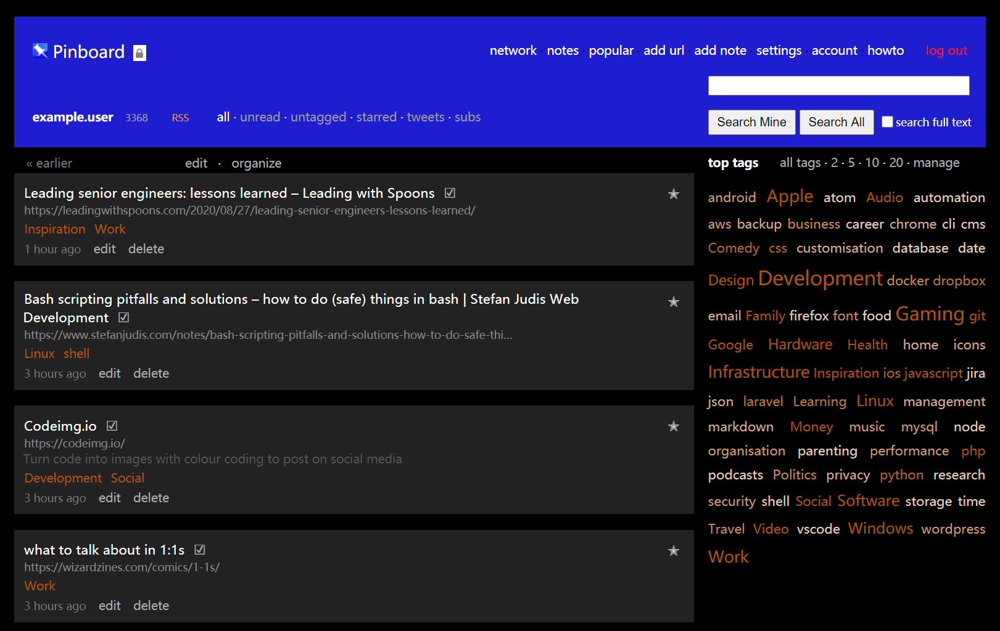

# Pinboard User Style

A more modern look for the bookmarking service [Pinboard](https://pinboard.in).

## Usage

You'll need the Stylish browser extension:
 * [Stylish for Chrome](https://chrome.google.com/webstore/detail/stylish/fjnbnpbmkenffdnngjfgmeleoegfcffe)
 * [Stylish for Safari](http://sobolev.us/stylish/)
 * [Stylish for Firefox](https://addons.mozilla.org/fr/firefox/addon/stylish/)

Then you can add the styles manually in the extension by applying them to *URLs on the domain* of *pinboard.in* or [install it from userstyles.org](https://userstyles.org/styles/113497/modern-pinboard-style).
