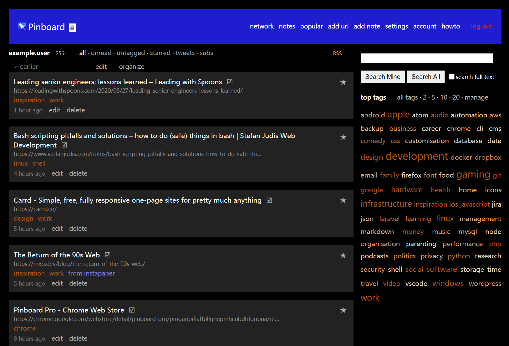

# Pinboard User Style

A more modern look for the bookmarking service [Pinboard](https://pinboard.in).

_An example of a bookmark list page with these custom styles applied._

## Setup

You'll first need to install the Stylish extension for your browser:

- [Stylish for Chrome](https://chrome.google.com/webstore/detail/stylish/fjnbnpbmkenffdnngjfgmeleoegfcffe)
- [Stylish for Firefox](https://addons.mozilla.org/fr/firefox/addon/stylish/)

Then you can add the styles manually in the extension by applying them to **URLs on the domain** of **pinboard.in**.

Alternatively, you could [install this style directly via userstyles.org](https://userstyles.org/styles/113497/modern-pinboard-style).
